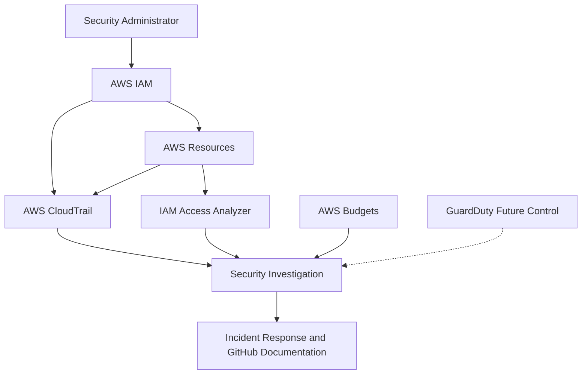

# AWS Cloud Security Monitoring Lab

## Project Overview

This project demonstrates the implementation and assessment of security controls in an AWS environment. It focuses on identity protection, least-privilege access, cloud activity monitoring, secure data storage, external-access analysis, incident investigation and professional security documentation.

The lab provides practical experience with AWS Identity and Access Management, AWS CloudTrail, AWS Budgets, Amazon S3, IAM Access Analyzer and IAM Policy Simulator.

## Project Objectives

* Implement AWS cost monitoring.
* Assess IAM identities and permissions.
* Protect privileged identities with MFA.
* Apply least privilege and attribute-based access control.
* Monitor account activity with CloudTrail.
* Generate and investigate controlled security events.
* Secure and assess an S3 bucket.
* Identify public or external access.
* Produce an incident-response report.
* Complete a final security assessment.
* Publish sanitized portfolio evidence.

## Project Architecture



### Monitoring Flow

1. The security administrator accesses AWS using an MFA-protected identity.
2. IAM controls users, groups and permissions.
3. Resource-tag conditions restrict development access.
4. Amazon S3 stores encrypted, private and versioned objects.
5. CloudTrail records AWS management and API activity.
6. IAM Access Analyzer checks for external resource access.
7. AWS Budgets provides early warning of unexpected spending.
8. Security events are investigated, classified and documented.
9. GuardDuty remains a future control because it is unavailable on the current Free account plan.

## Lab Environment

| Component            | Purpose                              | Status    |
| -------------------- | ------------------------------------ | --------- |
| AWS IAM              | Identity and permission management   | Completed |
| AWS CloudTrail       | API activity and event investigation | Completed |
| AWS Budgets          | Unexpected-spending detection        | Completed |
| Amazon S3            | Secure and versioned object storage  | Completed |
| IAM Access Analyzer  | External-access identification       | Completed |
| IAM Policy Simulator | Permission validation                | Completed |
| Amazon GuardDuty     | Managed threat detection             | Deferred  |
| GitHub               | Documentation and sanitized evidence | Completed |

## Project Progress

* [x] Create zero-spend AWS budget alert
* [x] Perform IAM security assessment
* [x] Enable MFA for privileged identities
* [x] Review IAM users, groups, roles and policies
* [x] Remediate excessive EC2 permissions
* [x] Implement development-tag access control
* [x] Test allowed and denied permissions
* [x] Analyze CloudTrail Event History
* [x] Investigate an IAM policy-change event
* [x] Generate and investigate a controlled `AccessDenied` event
* [x] Configure and assess S3 security
* [x] Test S3 object versioning
* [x] Configure IAM Access Analyzer
* [x] Review external-access findings
* [x] Evaluate Amazon GuardDuty availability
* [ ] Test GuardDuty threat detection — deferred because it is unavailable on the Free plan
* [x] Produce an incident-response report
* [x] Complete the final security assessment
* [x] Document lessons learned

## Completed Security Controls

### 1. Zero-Spend Budget Alert

A zero-spend AWS Budget notification was configured to provide early warning of unexpected resource usage, configuration mistakes or potentially unauthorized activity.

### 2. Multi-Factor Authentication

The initial assessment identified missing MFA as an authentication weakness. MFA was enabled and tested for privileged identities.

### 3. Least-Privilege EC2 Policy

The original development policy granted broad `ec2:*` permissions. It was remediated to allow only:

* `ec2:Describe*`
* `ec2:StartInstances`
* `ec2:StopInstances`
* `ec2:RebootInstances`

The policy explicitly denies:

* `ec2:TerminateInstances`
* `ec2:CreateTags`
* `ec2:DeleteTags`

Management actions are restricted to instances tagged:

```text
Env = development
```

### 4. IAM Policy Simulation

IAM Policy Simulator confirmed that:

* EC2 viewing was allowed.
* Development management actions were allowed.
* Production management actions were denied.
* Instance termination was explicitly denied.
* Tag creation was explicitly denied.

### 5. CloudTrail Investigation

CloudTrail Event History was used to investigate:

* A successful `CreatePolicyVersion` event
* The activation of policy version `v2`
* An authorized IAM configuration change
* A controlled unauthorized request
* An `AccessDenied` event generated by the development user

### 6. Secure Amazon S3 Configuration

An S3 bucket was configured with:

* Bucket Versioning
* SSE-S3 default encryption
* All Block Public Access controls
* Bucket owner enforcement
* Disabled ACLs
* An explicit denial of insecure HTTP transport
* A project-identification tag

Two versions of a harmless test object were uploaded to confirm that S3 retained separate versions.

### 7. IAM Access Analyzer

An external-access analyzer was created with the current AWS account as its zone of trust.

The completed scan returned zero active findings. No supported resource was detected as granting access outside the account at the time of assessment.

### 8. Incident Investigation

A restricted development user attempted an unauthorized IAM action.

IAM blocked the request, and CloudTrail recorded the activity with an `AccessDenied` error. The event was investigated and classified as an expected controlled security test.

The investigation confirmed:

* No unauthorized access occurred.
* No IAM configuration was changed.
* No data exposure was detected.
* The preventive IAM control worked correctly.
* CloudTrail provided sufficient evidence for investigation.

### 9. GuardDuty Limitation

Amazon GuardDuty was evaluated for threat-detection testing. However, it was unavailable under the current AWS Free account plan.

The account was not upgraded to avoid introducing chargeable usage. GuardDuty testing remains a documented future improvement.

## Security Outcomes

| Initial condition               | Security improvement                          |
| ------------------------------- | --------------------------------------------- |
| No cost-warning control         | Budget notification configured                |
| Password-only privileged access | MFA implemented                               |
| Broad `ec2:*` access            | Approved EC2 actions only                     |
| No termination restriction      | Explicit termination deny                     |
| Tag-modification risk           | Tag creation and deletion denied              |
| Environment access overlap      | Tag-based separation implemented              |
| Permissions not validated       | Allowed and denied actions simulated          |
| Activity not investigated       | CloudTrail events reviewed                    |
| No secure storage assessment    | S3 controls configured and tested             |
| Public-access risk              | Block Public Access enabled                   |
| Insecure transport possible     | HTTP access explicitly denied                 |
| Object-overwrite risk           | Versioning enabled and tested                 |
| External access not assessed    | Access Analyzer returned zero findings        |
| No incident documentation       | Controlled incident investigated and reported |
| GuardDuty unavailable           | Limitation documented                         |

## Documentation

Detailed documentation and sanitized evidence are available in:

* [Security controls and investigations](docs/security-controls.md)
* [Final security assessment](docs/security-assessment.md)
* [Lessons learned](docs/lessons-learned.md)
* [IAM AccessDenied incident report](incident-reports/iam-access-denied-investigation.md)
* [Project screenshots](screenshots/)

## Repository Structure

```text
aws-cloud-security-monitoring-lab/
├── README.md
├── docs/
│   ├── security-controls.md
│   ├── security-assessment.md
│   └── lessons-learned.md
├── screenshots/
├── policies/
├── incident-reports/
│   └── iam-access-denied-investigation.md
├── diagrams/
└── LICENSE
```

## Residual Risks and Future Improvements

* Enable and test GuardDuty when suitable billing controls are available.
* Configure automated alerts for repeated authorization failures.
* Review Access Analyzer whenever resource policies change.
* Perform scheduled IAM reviews.
* Add EventBridge and Amazon SNS alerting.
* Store reusable IAM policies in the `policies/` directory.
* Expand the project into a controlled multi-account environment.

## Security and Privacy

The repository does not contain passwords, secret keys, access-key identifiers, MFA codes, account numbers, personal email addresses, public IP addresses, private keys or unredacted screenshots.

All evidence was sanitized before publication.

## Skills Demonstrated

* AWS cloud security
* Identity and access management
* Multi-factor authentication
* Least-privilege policy design
* Attribute-based access control
* IAM Policy Simulator
* CloudTrail event analysis
* IAM policy-change investigation
* `AccessDenied` investigation
* Amazon S3 security
* Encryption at rest and in transit
* Public-access prevention
* Object versioning and recovery
* IAM Access Analyzer
* External-access assessment
* Incident-response documentation
* Risk assessment and remediation
* Sensitive-data handling
* Technical documentation

## Project Status

**Completed with one documented limitation.**

The AWS Budgets, IAM, CloudTrail, Amazon S3, IAM Access Analyzer, incident-response, final-assessment and lessons-learned phases are complete.

Amazon GuardDuty testing was deferred because the service is unavailable under the current AWS Free account plan.
