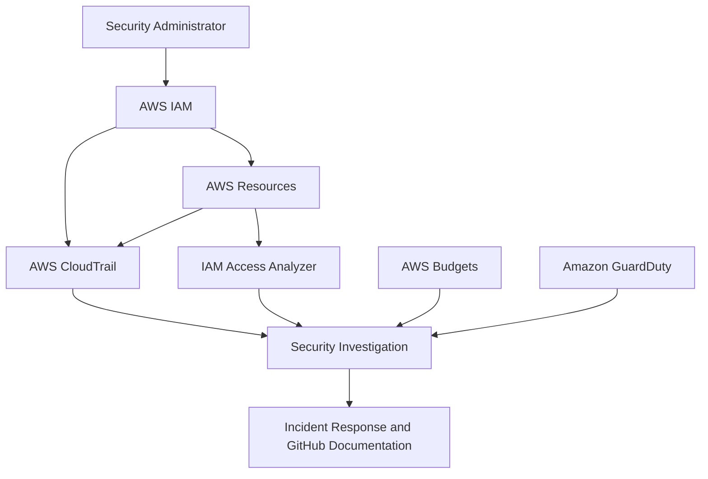

# AWS Cloud Security Monitoring Lab

## Project Overview

This project demonstrates the design and implementation of security monitoring controls in an AWS environment. It focuses on identity protection, least-privilege access, cloud activity monitoring, security-event investigation and incident-response preparation.

The lab provides practical experience with AWS Identity and Access Management (IAM), AWS CloudTrail, AWS Budgets, Amazon S3, IAM Access Analyzer and Amazon GuardDuty.

## Project Objectives

* Implement AWS cost and usage monitoring.
* Assess IAM users, groups, roles, policies and access keys.
* Secure privileged identities with multi-factor authentication.
* Apply least privilege and attribute-based access control.
* Monitor account activity using AWS CloudTrail.
* Generate and investigate controlled security events.
* Secure and assess an Amazon S3 bucket.
* Identify public or externally accessible resources.
* Detect potential threats with Amazon GuardDuty.
* Create professional security findings and incident reports.
* Document the project for a cybersecurity portfolio.

## Project Architecture



### Monitoring Flow

1. The security administrator accesses AWS using an IAM account protected by MFA.
2. AWS IAM controls users, groups, roles and permissions.
3. Resource-tag conditions restrict development access.
4. AWS CloudTrail records management and API activity.
5. IAM Access Analyzer identifies public or external access.
6. Amazon GuardDuty identifies potential threats.
7. AWS Budgets detects unexpected spending.
8. Findings are investigated, remediated and documented.

## Lab Environment

| Component            | Purpose                                            |
| -------------------- | -------------------------------------------------- |
| AWS IAM              | Identity, authentication and permission management |
| AWS CloudTrail       | Account activity and API-event logging             |
| AWS Budgets          | Unexpected-spending detection                      |
| Amazon S3            | Secure cloud-storage configuration                 |
| IAM Access Analyzer  | Public and external-access identification          |
| Amazon GuardDuty     | Threat detection and security findings             |
| IAM Policy Simulator | Permission and policy validation                   |
| GitHub               | Project documentation and sanitized evidence       |

## Project Progress

* [x] Create zero-spend AWS budget alert
* [x] Perform IAM security assessment
* [x] Enable MFA for privileged identities
* [x] Review users, groups, roles and policies
* [x] Remediate excessive EC2 permissions
* [x] Implement development-tag access control
* [x] Test allowed and denied permissions
* [x] Analyze CloudTrail event history
* [x] Investigate an IAM policy-change event
* [x] Generate and investigate a controlled AccessDenied event
* [ ] Configure and assess S3 security
* [ ] Review IAM Access Analyzer findings
* [ ] Test GuardDuty threat detection
* [ ] Produce an incident-response report
* [ ] Complete the final security assessment

## Completed Security Controls

### 1. Zero-Spend Budget Alert

A zero-spend AWS Budget was configured to send an email notification when detected account spending exceeds $0.01. This provides early warning of unexpected resource usage, configuration mistakes or potentially unauthorized activity.

### 2. Multi-Factor Authentication

The initial IAM assessment identified missing MFA as an authentication weakness. MFA was enabled and tested to strengthen privileged console access against password compromise.

### 3. Least-Privilege EC2 Policy

The original development policy granted broad `ec2:*` permissions. It was remediated by allowing only:

* `ec2:Describe*`
* `ec2:StartInstances`
* `ec2:StopInstances`
* `ec2:RebootInstances`

The policy explicitly denies:

* `ec2:TerminateInstances`
* `ec2:CreateTags`
* `ec2:DeleteTags`

Start, stop and reboot operations are restricted to EC2 instances carrying this resource tag:

```text
Env = development
```

### 4. IAM Policy Simulation

The IAM Policy Simulator confirmed that:

* EC2 viewing was allowed.
* Terminating instances was explicitly denied.
* Creating tags was explicitly denied.
* Basic management was allowed for development-tagged instances.
* The same actions were denied for production-tagged instances.

### 5. CloudTrail Event Investigation

CloudTrail Event History was used to investigate:

* A successful `CreatePolicyVersion` event that created policy version `v2`
* An authorized IAM policy modification
* A controlled unauthorized IAM request
* An `AccessDenied` event generated by the development user

The investigation demonstrated how to distinguish expected administrative activity from prohibited or potentially suspicious behavior.

## Security Outcomes

| Initial condition                      | Security improvement                      |
| -------------------------------------- | ----------------------------------------- |
| No cost-warning control                | Zero-spend budget notification configured |
| Password-only authentication           | MFA protection implemented                |
| Broad `ec2:*` permission               | Limited approved EC2 actions              |
| No termination restriction             | Explicit termination deny                 |
| Development and production access risk | Tag-based environment separation          |
| Permissions not fully validated        | Allowed and denied actions simulated      |
| Activity not investigated              | CloudTrail events reviewed and classified |

## Documentation

Detailed implementation notes, findings, remediation steps and evidence are available in:

* [Security controls and investigations](docs/security-controls.md)
* [Project screenshots](screenshots/)

Additional documents will be added as the project continues:

* `docs/security-assessment.md`
* `docs/lessons-learned.md`
* `incident-reports/`
* `policies/`

## Repository Structure

```text
aws-cloud-security-monitoring-lab/
├── README.md
├── docs/
│   ├── security-controls.md
│   ├── security-assessment.md
│   └── lessons-learned.md
├── screenshots/
├── policies/
├── incident-reports/
├── diagrams/
└── LICENSE
```

## Security and Privacy

This repository does not store passwords, access keys, secret keys, MFA QR codes, authentication codes, AWS account numbers, private keys, personal email addresses, public IP addresses or unredacted sensitive screenshots.

All evidence is reviewed and sanitized before publication.

## Skills Demonstrated

* AWS cloud security
* Identity and access management
* Multi-factor authentication
* Least-privilege policy design
* Attribute-based access control
* IAM Policy Simulator
* CloudTrail event analysis
* AccessDenied investigation
* Security-event classification
* Incident-response reasoning
* Sensitive-data handling
* Technical documentation

## Project Status

**In progress**

The IAM and CloudTrail phases are complete. The next phase focuses on secure Amazon S3 configuration and access analysis.

## Status

This project is currently in progress.
