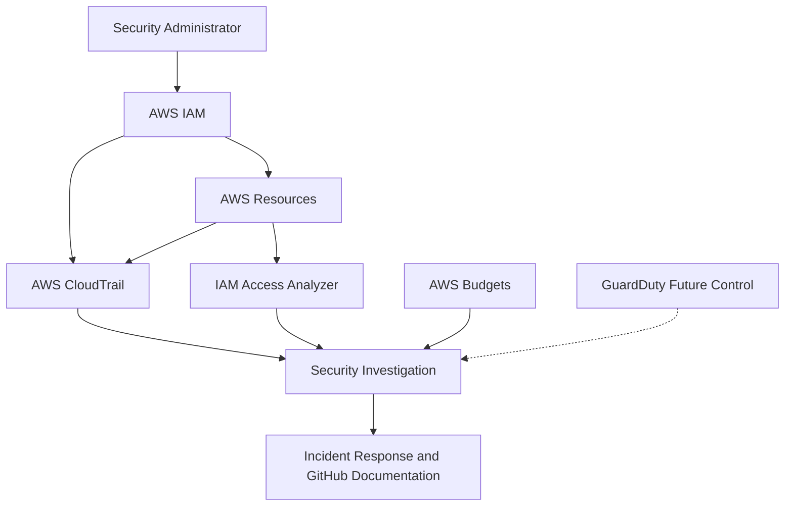

# AWS Cloud Security Monitoring Lab

## Project Overview

This project demonstrates the design, implementation and assessment of security controls in an AWS environment. It focuses on identity protection, least-privilege access, cloud activity monitoring, secure data storage, external-access analysis, security-event investigation and incident response.

The lab provides practical experience with AWS Identity and Access Management, AWS CloudTrail, AWS Budgets, Amazon S3, IAM Access Analyzer and the IAM Policy Simulator.

## Project Objectives

* Implement AWS cost and usage monitoring.
* Assess IAM users, groups, roles, policies and access keys.
* Secure privileged identities with multi-factor authentication.
* Apply least privilege and attribute-based access control.
* Monitor account activity using AWS CloudTrail.
* Generate and investigate controlled security events.
* Secure and assess an Amazon S3 bucket.
* Identify public or externally accessible resources.
* Evaluate Amazon GuardDuty availability.
* Create a professional incident report.
* Complete a final security assessment.
* Document sanitized evidence for a cybersecurity portfolio.

## Project Architecture



### Monitoring Flow

1. The security administrator accesses AWS using an IAM account protected by MFA.
2. AWS IAM controls users, groups, roles and permissions.
3. Resource-tag conditions restrict development access.
4. Amazon S3 stores encrypted, versioned and non-public objects.
5. AWS CloudTrail records management and API activity.
6. IAM Access Analyzer identifies public or external access.
7. AWS Budgets provides early warning of unexpected spending.
8. Findings are investigated, classified, remediated and documented.
9. Amazon GuardDuty remains a future control because it is unavailable under the current AWS Free account plan.

## Lab Environment

| Component            | Purpose                                            | Assessment status |
| -------------------- | -------------------------------------------------- | ----------------- |
| AWS IAM              | Identity, authentication and permission management | Completed         |
| AWS CloudTrail       | Account activity and API-event investigation       | Completed         |
| AWS Budgets          | Unexpected-spending detection                      | Completed         |
| Amazon S3            | Secure, encrypted and versioned object storage     | Completed         |
| IAM Access Analyzer  | Public and external-access identification          | Completed         |
| IAM Policy Simulator | Permission and policy validation                   | Completed         |
| Amazon GuardDuty     | Managed threat detection                           | Deferred          |
| GitHub               | Documentation and sanitized evidence               | Completed         |

## Project Progress

* [x] Create zero-spend AWS budget alert
* [x] Perform IAM security assessment
* [x] Enable MFA for privileged identities
* [x] Review users, groups, roles and policies
* [x] Remediate excessive EC2 permissions
* [x] Implement development-tag access control
* [x] Test allowed and denied permissions
* [x] Analyze CloudTrail event history
* [x] Investigate an IAM policy-change event
* [x] Generate and investigate a controlled `AccessDenied` event
* [x] Configure and assess S3 security
* [x] Test S3 object versioning
* [x] Configure IAM Access Analyzer
* [x] Review IAM Access Analyzer findings
* [x] Evaluate Amazon GuardDuty availability
* [ ] Test GuardDuty threat detection — deferred because GuardDuty is unavailable on the Free plan
* [x] Produce an incident-response report
* [x] Complete the final security assessment

## Completed Security Controls

### 1. Zero-Spend Budget Alert

A zero-spend AWS Budget was configured to send an email notification when detected spending exceeds the configured threshold.

This provides early warning of unexpected resource usage, configuration mistakes or potentially unauthorized activity.

### 2. Multi-Factor Authentication

The initial IAM assessment identified missing MFA as an authentication weakness.

MFA was enabled and tested to strengthen privileged console access against password compromise.

### 3. Least-Privilege EC2 Policy

The original development policy granted broad `ec2:*` permissions. It was remediated by allowing only:

* `ec2:Describe*`
* `ec2:StartInstances`
* `ec2:StopInstances`
* `ec2:RebootInstances`

The policy explicitly denies:

* `ec2:TerminateInstances`
* `ec2:CreateTags`
* `ec2:DeleteTags`

Start, stop and reboot operations are restricted to EC2 instances tagged:

```text
Env = development
```

This prevents development users from performing the same management actions against production-tagged instances.

### 4. IAM Policy Simulation

IAM Policy Simulator testing confirmed that:

* EC2 viewing was allowed.
* Instance termination was explicitly denied.
* Tag creation was explicitly denied.
* Basic management was allowed for development-tagged resources.
* The same management actions were denied for production-tagged resources.

### 5. CloudTrail Event Investigation

AWS CloudTrail Event History was used to investigate:

* A successful `CreatePolicyVersion` event
* The creation and activation of policy version `v2`
* An authorized IAM policy change
* A controlled unauthorized IAM request
* An `AccessDenied` event generated by the development user

The investigation demonstrated how to review identity, event source, event name, Region, request parameters, response details, error information and other security-relevant fields.

### 6. Secure Amazon S3 Configuration

An Amazon S3 bucket was configured with:

* Bucket Versioning enabled
* SSE-S3 default encryption
* All four Block Public Access controls enabled
* Bucket owner enforced
* Access control lists disabled
* An explicit deny for insecure HTTP connections
* A project-identification tag

Two versions of a harmless test object were uploaded to verify that S3 retained separate object versions successfully.

### 7. IAM Access Analyzer

An external-access analyzer was created with the current AWS account as its zone of trust.

The completed scan returned zero active findings. This indicates that no supported resource was detected as granting access outside the account at the time of the assessment.

A zero-finding result does not guarantee that the entire AWS account is free from every security risk. The analyzer should be reviewed again whenever resource policies change.

### 8. Controlled Incident Investigation

A restricted development user attempted to access an unauthorized IAM resource.

AWS IAM denied the request, and CloudTrail recorded the activity with an `AccessDenied` error. The event was investigated and classified as an expected controlled security test.

The test confirmed that:

* Least-privilege permissions prevented unauthorized access.
* CloudTrail recorded the denied request.
* No IAM configuration was changed.
* No data exposure was detected.
* The event contained sufficient information for investigation.

### 9. GuardDuty Assessment Limitation

Amazon GuardDuty was evaluated for threat-detection testing. However, the service was unavailable under the current AWS Free account plan.

The account was not upgraded because doing so could introduce chargeable service usage. GuardDuty testing is therefore recorded as a future security enhancement rather than a completed technical test.

## Security Outcomes

| Initial condition                      | Security improvement                          |
| -------------------------------------- | --------------------------------------------- |
| No cost-warning control                | Zero-spend budget notification configured     |
| Password-only authentication           | MFA protection implemented                    |
| Broad `ec2:*` permission               | Access limited to approved EC2 actions        |
| No termination restriction             | Instance termination explicitly denied        |
| Tag modification risk                  | Tag creation and deletion explicitly denied   |
| Development and production access risk | Tag-based environment separation implemented  |
| Permissions not fully validated        | Allowed and denied actions simulated          |
| Cloud activity not investigated        | CloudTrail events reviewed and classified     |
| No protected cloud-storage resource    | Secure S3 bucket configured                   |
| Risk of accidental public access       | All Block Public Access controls enabled      |
| Unencrypted transport possible         | Insecure HTTP requests explicitly denied      |
| Risk of accidental object overwrite    | Versioning enabled and tested                 |
| External access not evaluated          | Access Analyzer configured with zero findings |
| No documented response procedure       | Controlled incident investigated and reported |
| GuardDuty unavailable                  | Limitation documented as a future enhancement |

## Key Assessment Findings

| Finding                                   | Initial risk | Final status        |
| ----------------------------------------- | ------------ | ------------------- |
| Missing MFA                               | High         | Remediated          |
| Excessive EC2 permissions                 | High         | Remediated          |
| EC2 termination risk                      | High         | Remediated          |
| Resource-tag modification risk            | High         | Remediated          |
| Development and production access overlap | High         | Remediated          |
| Cloud activity not formally investigated  | Medium       | Remediated          |
| S3 controls not validated                 | Medium       | Remediated          |
| External access not assessed              | Medium       | Remediated          |
| No cost-warning control                   | Medium       | Remediated          |
| GuardDuty unavailable on Free plan        | Medium       | Accepted limitation |

## Documentation

Detailed documentation and sanitized evidence are available in:

* [Security controls and investigations](docs/security-controls.md)
* [Final security assessment](docs/security-assessment.md)
* [IAM AccessDenied incident report](incident-reports/iam-access-denied-investigation.md)
* [Project screenshots](screenshots/)

## Repository Structure

```text
aws-cloud-security-monitoring-lab/
├── README.md
├── docs/
│   ├── security-controls.md
│   ├── security-assessment.md
│   └── lessons-learned.md
├── screenshots/
│   └── sanitized AWS evidence
├── policies/
│   └── IAM policy documents
├── incident-reports/
│   └── iam-access-denied-investigation.md
├── diagrams/
└── LICENSE
```

## Residual Risks and Future Improvements

The following items remain for future improvement:

* Enable and test Amazon GuardDuty when suitable account access and billing controls are available.
* Configure automated alerts for repeated authorization failures.
* Review IAM Access Analyzer whenever resource policies change.
* Perform scheduled reviews of users, roles, policies and access keys.
* Expand the lab into a controlled multi-account environment.
* Store reusable IAM policies in the `policies/` directory.
* Continue monitoring AWS spending and resource usage.

## Security and Privacy

This repository does not store:

* Passwords
* Access keys or secret keys
* MFA QR codes or authentication codes
* AWS account numbers
* Private keys
* Personal email addresses
* Public IP addresses
* Unsanitized usernames
* Unredacted AWS screenshots

All published evidence is reviewed and sanitized before uploading.

## Skills Demonstrated

* AWS cloud security
* Identity and access management
* Multi-factor authentication
* Least-privilege policy design
* Attribute-based access control
* IAM Policy Simulator
* CloudTrail event analysis
* IAM policy-change investigation
* `AccessDenied` investigation
* Amazon S3 security
* Encryption at rest and in transit
* Public-access prevention
* Object versioning and recovery
* Bucket-policy configuration
* IAM Access Analyzer
* External-access assessment
* Security finding classification
* Incident-response documentation
* Risk assessment and remediation
* Sensitive-data handling
* Technical documentation

## Project Status

**Core security assessment completed with one documented limitation.**

The AWS Budgets, IAM, CloudTrail, Amazon S3, IAM Access Analyzer, incident-response and final-assessment phases are complete.

Amazon GuardDuty testing has been deferred because the service is unavailable under the current AWS Free account plan.
