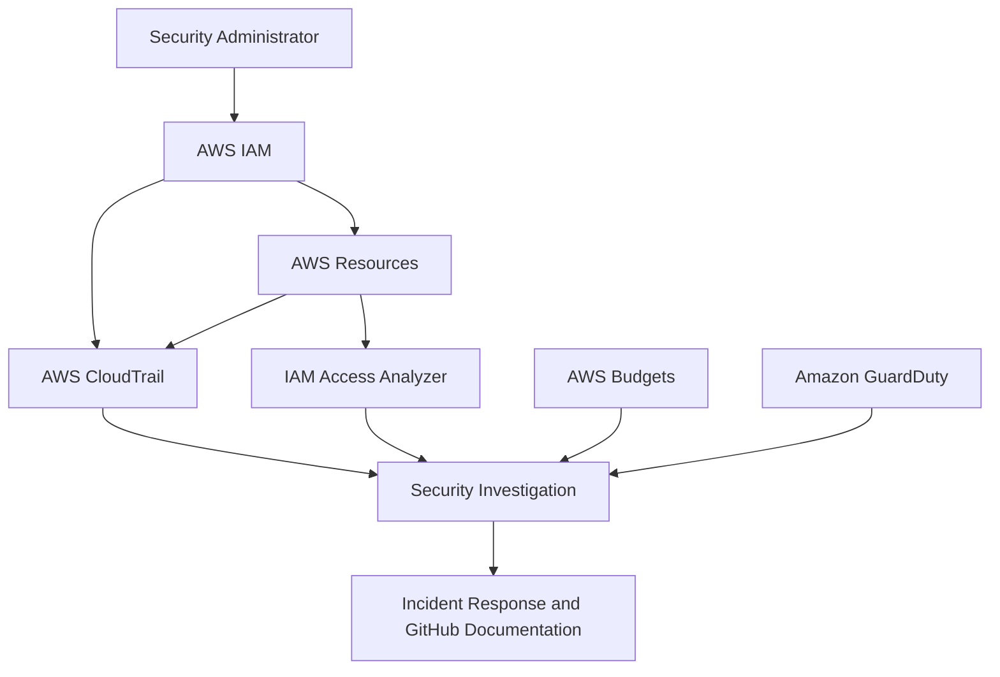

# AWS Cloud Security Monitoring Lab

## Project Overview

This project demonstrates the design and implementation of security controls in an AWS environment. It focuses on identity protection, least-privilege access, cloud activity monitoring, secure data storage, external-access analysis, security-event investigation and incident-response preparation.

The lab provides practical experience with AWS Identity and Access Management (IAM), AWS CloudTrail, AWS Budgets, Amazon S3, IAM Access Analyzer and Amazon GuardDuty.

## Project Objectives

* Implement AWS cost and usage monitoring.
* Assess IAM users, groups, roles, policies and access keys.
* Secure privileged identities with multi-factor authentication.
* Apply least privilege and attribute-based access control.
* Monitor account activity using AWS CloudTrail.
* Generate and investigate controlled security events.
* Secure and assess an Amazon S3 bucket.
* Identify public or externally accessible resources.
* Detect potential threats with Amazon GuardDuty.
* Create professional security findings and incident reports.
* Document the project for a cybersecurity portfolio.

## Project Architecture



### Monitoring Flow

1. The security administrator accesses AWS using an IAM account protected by MFA.
2. AWS IAM controls users, groups, roles and permissions.
3. Resource-tag conditions restrict development access.
4. Amazon S3 stores encrypted, versioned and non-public objects.
5. AWS CloudTrail records management and API activity.
6. IAM Access Analyzer identifies public or external access.
7. Amazon GuardDuty identifies potential threats.
8. AWS Budgets detects unexpected spending.
9. Findings are investigated, remediated and documented.

## Lab Environment

| Component            | Purpose                                            |
| -------------------- | -------------------------------------------------- |
| AWS IAM              | Identity, authentication and permission management |
| AWS CloudTrail       | Account activity and API-event logging             |
| AWS Budgets          | Unexpected-spending detection                      |
| Amazon S3            | Secure, encrypted and versioned object storage     |
| IAM Access Analyzer  | Public and external-access identification          |
| Amazon GuardDuty     | Threat detection and security findings             |
| IAM Policy Simulator | Permission and policy validation                   |
| GitHub               | Project documentation and sanitized evidence       |

## Project Progress

* [x] Create zero-spend AWS budget alert
* [x] Perform IAM security assessment
* [x] Enable MFA for privileged identities
* [x] Review users, groups, roles and policies
* [x] Remediate excessive EC2 permissions
* [x] Implement development-tag access control
* [x] Test allowed and denied permissions
* [x] Analyze CloudTrail event history
* [x] Investigate an IAM policy-change event
* [x] Generate and investigate a controlled AccessDenied event
* [x] Configure and assess S3 security
* [x] Test S3 object versioning
* [x] Configure IAM Access Analyzer
* [x] Review IAM Access Analyzer findings
* [ ] Test GuardDuty threat detection
* [ ] Produce an incident-response report
* [ ] Complete the final security assessment

## Completed Security Controls

### 1. Zero-Spend Budget Alert

A zero-spend AWS Budget was configured to send an email notification when detected account spending exceeds $0.01.

### 2. Multi-Factor Authentication

MFA was enabled and tested to strengthen privileged console access against password compromise.

### 3. Least-Privilege EC2 Policy

The original development policy granted broad `ec2:*` permissions. It was remediated by allowing only EC2 viewing, starting, stopping and rebooting.

Termination and tag modification were explicitly denied. Operational actions were restricted to instances tagged:

```text
Env = development
```

### 4. IAM Policy Simulation

Policy Simulator testing confirmed:

* EC2 viewing was allowed.
* Instance termination was explicitly denied.
* Tag creation was explicitly denied.
* Basic management was allowed for development resources.
* The same management actions were denied for production resources.

### 5. CloudTrail Event Investigation

CloudTrail was used to investigate:

* A successful `CreatePolicyVersion` event
* The creation and activation of policy version `v2`
* A controlled unauthorized IAM request
* An `AccessDenied` event generated by the development user

### 6. Secure Amazon S3 Configuration

An S3 bucket was configured with:

* Bucket Versioning
* SSE-S3 default encryption
* Block Public Access
* Bucket owner enforcement
* Disabled ACLs
* An HTTPS-enforcement policy
* A project-identification tag

Two versions of a test object were uploaded to verify version retention and recovery capability.

### 7. IAM Access Analyzer

An external-access analyzer was created with the current AWS account as its zone of trust.

The completed scan returned zero active findings, indicating that no supported resource was detected as granting access outside the account at the time of analysis.

## Security Outcomes

| Initial condition                      | Security improvement                          |
| -------------------------------------- | --------------------------------------------- |
| No cost-warning control                | Zero-spend budget notification configured     |
| Password-only authentication           | MFA protection implemented                    |
| Broad `ec2:*` permission               | Limited approved EC2 actions                  |
| No termination restriction             | Explicit termination deny                     |
| Development and production access risk | Tag-based environment separation              |
| Permissions not fully validated        | Allowed and denied actions simulated          |
| Cloud activity not investigated        | CloudTrail events reviewed and classified     |
| No protected cloud-storage resource    | Secure S3 bucket configured                   |
| Risk of accidental public access       | All Block Public Access controls enabled      |
| Unencrypted transport possible         | Insecure HTTP requests explicitly denied      |
| Risk of accidental object overwrite    | Versioning enabled and tested                 |
| External access not evaluated          | Access Analyzer configured with zero findings |

## Documentation

Detailed implementation notes, findings, remediation steps and evidence are available in:

* [Security controls and investigations](docs/security-controls.md)
* [Project screenshots](screenshots/)

Additional documents will be added as the project continues:

* `docs/security-assessment.md`
* `docs/lessons-learned.md`
* `incident-reports/`
* `policies/`

## Repository Structure

```text
aws-cloud-security-monitoring-lab/
├── README.md
├── docs/
│   ├── security-controls.md
│   ├── security-assessment.md
│   └── lessons-learned.md
├── screenshots/
├── policies/
├── incident-reports/
├── diagrams/
└── LICENSE
```

## Security and Privacy

This repository does not store passwords, access keys, secret keys, MFA QR codes, authentication codes, AWS account numbers, private keys, personal email addresses, public IP addresses or unredacted sensitive screenshots.

All evidence is reviewed and sanitized before publication.

## Skills Demonstrated

* AWS cloud security
* Identity and access management
* Multi-factor authentication
* Least-privilege policy design
* Attribute-based access control
* IAM Policy Simulator
* CloudTrail event analysis
* AccessDenied investigation
* Amazon S3 security
* Encryption at rest and in transit
* Public-access prevention
* Object versioning and recovery
* IAM Access Analyzer
* External-access analysis
* Resource-policy assessment
* Security-event classification
* Incident-response reasoning
* Sensitive-data handling
* Technical documentation

## Project Status

**In progress**

The AWS Budgets, IAM, CloudTrail, S3 and Access Analyzer phases are complete. The next phase focuses on Amazon GuardDuty threat detection.
