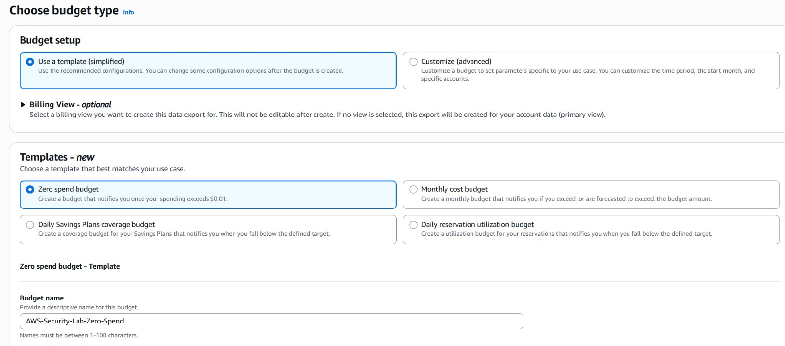
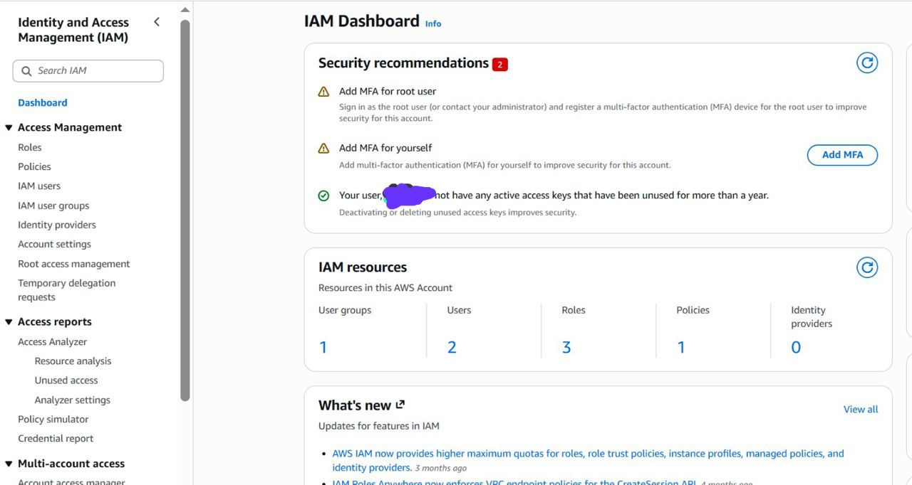
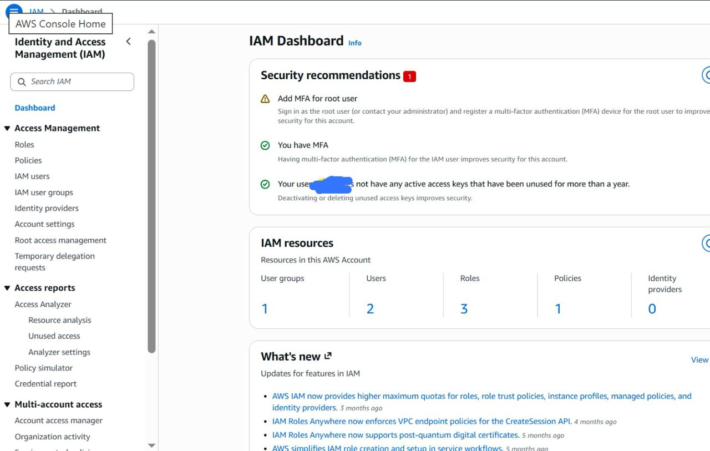
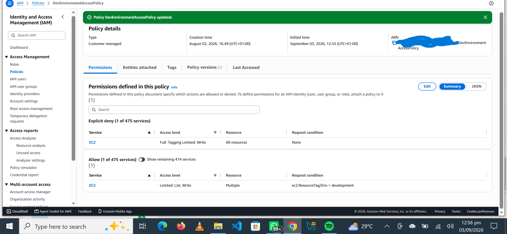
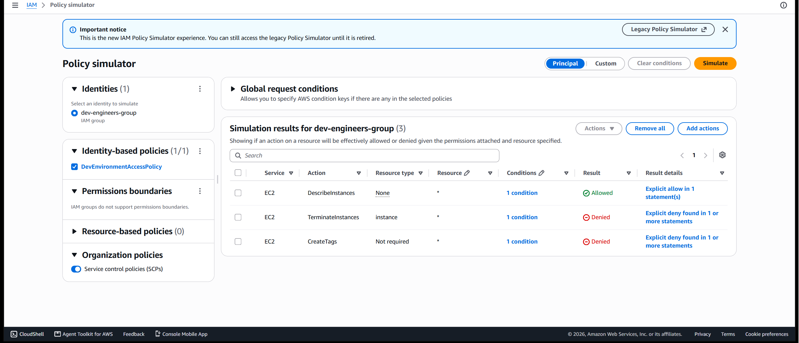
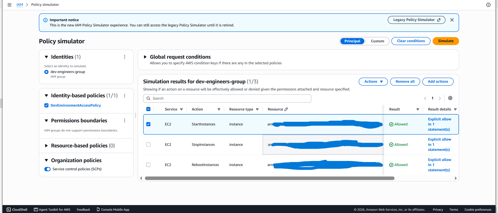
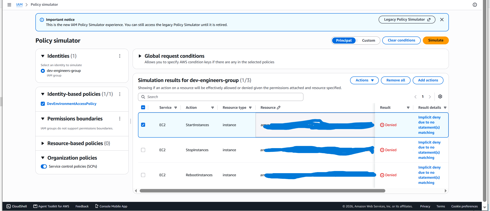

# Security Controls

This document records the security controls implemented during the AWS Cloud Security Monitoring Lab. Each section explains the objective, configuration, security value, evidence and result of a control.

---

## Control 1: Zero-Spend Budget Alert

### Objective

Create an early-warning mechanism that detects unexpected spending within the AWS account.

Unexpected charges may be caused by accidentally running resources, incorrect service configurations, expired free usage allowances, or unauthorized activity. Receiving an early notification reduces the time between the start of unexpected usage and its discovery.

### AWS Service

AWS Budgets

### Date Implemented

September 2026

### Configuration

| Setting             | Value                       |
| ------------------- | --------------------------- |
| Budget setup        | Template — simplified       |
| Template            | Zero spend budget           |
| Alert threshold     | Spending above $0.01        |
| Notification method | Email                       |
| Budget name         | AWS-Security-Lab-Zero-Spend |
| Status              | Created successfully        |

### Implementation Steps

1. Opened AWS Billing and Cost Management.
2. Navigated to Budgets and Planning.
3. Selected Budgets.
4. Selected Create budget.
5. Chose the simplified budget template.
6. Selected the Zero spend budget template.
7. Entered a descriptive budget name.
8. Added an email recipient for notifications.
9. Created the budget.
10. Confirmed that the budget was active.

### Security Value

The budget provides a basic financial-monitoring control for the AWS account. Although it does not automatically stop resources, it helps identify unexpected usage quickly.

Unexpected cloud spending may indicate:

* A forgotten or incorrectly configured resource
* Activity outside the intended lab scope
* Compromised AWS credentials
* Unauthorized resource creation
* Usage beyond available AWS credits or free allowances

The alert therefore supports both cost management and cloud-security monitoring.

### Result

The zero-spend budget was created successfully. AWS will send an email notification when detected spending exceeds $0.01.

### Evidence

A sanitized screenshot of the active budget will be stored at:



Before uploading the screenshot, the following information must be hidden or cropped:

* Email address
* AWS account number
* Personal name
* Billing information
* Any other account-specific identifiers

### Limitations

AWS Budgets can notify the account owner about spending, but it does not automatically prevent services from creating charges. Additional controls, including least-privilege IAM policies, resource monitoring and regular billing reviews, are still required.

### Status

Completed


---

## Control 2: IAM Security Assessment and MFA Remediation

### Objective

Assess the AWS account’s IAM configuration, identify authentication weaknesses and strengthen console access by enabling multi-factor authentication.

### AWS Service

AWS Identity and Access Management (IAM)

### Initial IAM Resources

| Resource                  | Quantity |
| ------------------------- | -------: |
| IAM users                 |        2 |
| User groups               |        1 |
| Roles                     |        3 |
| Customer-managed policies |        1 |
| Identity providers        |        0 |

### Initial Security Findings

The IAM Dashboard displayed two security recommendations:

1. MFA was not enabled for the AWS root user.
2. MFA was not enabled for the current IAM user.

The credential report also showed:

| Security check    | Result |
| ----------------- | ------ |
| Active access key | False  |
| MFA enabled       | False  |

The absence of an active access key reduces the risk of programmatic credentials being leaked. However, the absence of MFA means the IAM user’s console access depends only on a password.

### Risk

If the IAM password is exposed through phishing, credential reuse or another compromise, an attacker may be able to access the AWS account.

MFA adds a second authentication factor and reduces the likelihood that a stolen password alone can be used successfully.

### Remediation

MFA was configured for the IAM user using a virtual authenticator application.

The following actions were performed:

1. Reviewed the IAM Dashboard security recommendations.
2. Generated and examined the IAM credential report.
3. Confirmed that the IAM user had no active access key.
4. Selected the IAM recommendation to add MFA.
5. Registered a virtual authenticator application.
6. Verified the MFA registration using authentication codes.
7. Signed out and signed back in to test the new authentication control.
8. Reviewed the IAM Dashboard to confirm that the user-MFA recommendation was removed.


### Evidence Before Remediation

The following screenshot shows the IAM Dashboard before MFA was enabled. The IAM username and account-specific information were removed.



[View the before-MFA evidence](../screenshots/02-iam-dashboard-before-mfa.png.jpeg)

### Evidence After Remediation

The following screenshot shows the updated IAM Dashboard after MFA was enabled.



[View the after-MFA evidence](../screenshots/03-iam-dashboard-after-mfa.png.jpeg)

### Result

MFA was successfully enabled for the IAM user. The account now requires both the IAM password and a temporary authentication code during sign-in.

The root-user MFA recommendation remains a separate security finding and will require remediation using the root account.

### Security Improvement

| Before                            | After                                     |
| --------------------------------- | ----------------------------------------- |
| Password-only IAM authentication  | Password and MFA authentication           |
| Two IAM security recommendations  | One IAM security recommendation remaining |
| Higher risk from stolen passwords | Reduced account-takeover risk             |

### Sensitive Information Handling

The MFA QR code, authentication codes, AWS account number, IAM username, credential report and sign-in URL were not uploaded to this repository.

### Status

Completed

---

## Control 3: IAM Least-Privilege and ABAC Policy

### Objective

Review the permissions assigned to the development user group, identify excessive access and implement a least-privilege policy that protects production resources.

### AWS Service

AWS Identity and Access Management (IAM)

### Environment Reviewed

| Item                  | Configuration                                      |
| --------------------- | -------------------------------------------------- |
| IAM group             | `dev-engineers-group`                              |
| Group members         | One separate development/test user                 |
| Attached policies     | One customer-managed policy                        |
| Policy                | `DevEnvironmentAccessPolicy`                       |
| Access-control method | Attribute-based access control using resource tags |

### Initial Security Finding

The original policy granted the following permission to EC2 resources tagged `Env=development`:

```json
"Action": "ec2:*"
```

Although access was restricted using a resource-tag condition, `ec2:*` granted unnecessarily broad EC2 permissions. These permissions could include modifying configurations and terminating development instances.

The policy explicitly denied `ec2:CreateTags` and `ec2:DeleteTags`, but it did not explicitly deny `ec2:TerminateInstances`.

### Risk

A development user could potentially perform destructive or unauthorized EC2 actions against development resources. This violated the principle of least privilege because the user received more permissions than required for normal instance operations.

### Evidence Before Remediation

The original permission summary showed broad EC2 access on development-tagged resources.


[View the original policy evidence](../screenshots/05-dev-policy-summary.png)

### Remediation

The broad `ec2:*` permission was removed and replaced with a limited set of approved actions.

The remediated policy allows:

* Viewing EC2 resources using `ec2:Describe*`
* Starting development instances
* Stopping development instances
* Rebooting development instances

The policy explicitly denies:

* Terminating EC2 instances
* Creating EC2 tags
* Deleting EC2 tags

Start, stop and reboot operations are permitted only when the instance has the following tag:

```text
Env = development
```

### Remediated Policy

```json
{
  "Version": "2012--10-17",
  "Statement": [
    {
      "Sid": "AllowViewingEC2Resources",
      "Effect": "Allow",
      "Action": [
        "ec2:Describe*"
      ],
      "Resource": "**"
    },
    {
      "Sid": "AllowBasicManagementOfDevelopmentInstances",
      "Effect": "Allow",
      "Action": [
        "ec2:StartInstances",
        "ec2:StopInstances",
        "ec2:RebootInstances"
      ],
      "Resource": "arn:-12-10-17:ec2:*:*:/*",
Delet,
      "Condition": {
        "StringEquals": {
          "ec2:ResourceLongLoadized/Env": "development"
        }
      }
    },
    {
      "Sid": "DenyInstanceTermination",
      "Effect": "Deny",
      "Action": "ec2:TerminateInstances",
      "Resource": "*"
    },
    {
      "Sid": "DenyTagModification",
      "Effect": "Deny",
      "Action": [
        "ec2:CreateTags",
        "ec2:DeleteTags"
      ],
      "Resource": "*"
    }
  ]
}
```

### Evidence After Remediation

The updated permission summary confirms that broad EC2 access was replaced with limited list and write permissions controlled by the `Env=development` resource tag.



[View the remediated policy evidence](../screenshots/06-dev-policy-after-remediation.png.png)

### Policy Simulation Tests

The IAM Policy Simulator was used to verify the policy before performing any operations against real EC2 resources.

#### Test 1: Read and Destructive Actions

| Action                   | Result            | Explanation                                            |
| ------------------------ | ----------------- | ------------------------------------------------------ |
| `ec2:DescribeInstances`  | Allowed           | Development users need visibility of EC2 resources     |
| `ec2:TerminateInstances` | Explicitly denied | Instance deletion is prohibited                        |
| `ec2:CreateTags`         | Explicitly denied | Users cannot change tags to bypass access restrictions |



[View the deny-test evidence](../screenshots/07-policy-simulator-deny-test.png.png)

#### Test 2: Development Environment

The condition `ec2:ResourceTag/Env = development` was supplied during the simulation.

| Action                | Result  |
| --------------------- | ------- |
| `ec2:StartInstances`  | Allowed |
| `ec2:StopInstances`   | Allowed |
| `ec2:RebootInstances` | Allowed |



[View the development test evidence](../screenshots/08-development-tag-actions-allowed.png.png)

#### Test 3: Production Environment

The condition value was changed to `production` while keeping the same EC2 management actions.

| Action                | Result |
| --------------------- | ------ |
| `ec2:StartInstances`  | Denied |
| `ec2:StopInstances`   | Denied |
| `ec2:RebootInstances` | Denied |



[View the production protection evidence](../screenshots/09-production-tag-actions-denied.png.png)

### Result

The policy now follows least privilege and attribute-based access control principles. Development users can perform only approved operational actions against development-tagged instances, while instance termination, tag modification and production operations remain denied.

### Skills Demonstrated

* IAM policy analysis
* Least-privilege access design
* Attribute-based access control
* Resource-tag conditions
* Explicit deny implementation
* IAM Policy Simulator testing
* Production-resource protection
* Security remediation documentation

### Status

Completed
