# Security Controls

This document records the security controls implemented during the AWS Cloud Security Monitoring Lab. Each section explains the objective, configuration, security value, evidence and result of a control.

---

## Control 1: Zero-Spend Budget Alert

### Objective

Create an early-warning mechanism that detects unexpected spending within the AWS account.

Unexpected charges may be caused by accidentally running resources, incorrect service configurations, expired free usage allowances, or unauthorized activity. Receiving an early notification reduces the time between the start of unexpected usage and its discovery.

### AWS Service

AWS Budgets

### Date Implemented

September 2026

### Configuration

| Setting             | Value                       |
| ------------------- | --------------------------- |
| Budget setup        | Template — simplified       |
| Template            | Zero spend budget           |
| Alert threshold     | Spending above $0.01        |
| Notification method | Email                       |
| Budget name         | AWS-Security-Lab-Zero-Spend |
| Status              | Created successfully        |

### Implementation Steps

1. Opened AWS Billing and Cost Management.
2. Navigated to Budgets and Planning.
3. Selected Budgets.
4. Selected Create budget.
5. Chose the simplified budget template.
6. Selected the Zero spend budget template.
7. Entered a descriptive budget name.
8. Added an email recipient for notifications.
9. Created the budget.
10. Confirmed that the budget was active.

### Security Value

The budget provides a basic financial-monitoring control for the AWS account. Although it does not automatically stop resources, it helps identify unexpected usage quickly.

Unexpected cloud spending may indicate:

* A forgotten or incorrectly configured resource
* Activity outside the intended lab scope
* Compromised AWS credentials
* Unauthorized resource creation
* Usage beyond available AWS credits or free allowances

The alert therefore supports both cost management and cloud-security monitoring.

### Result

The zero-spend budget was created successfully. AWS will send an email notification when detected spending exceeds $0.01.

### Evidence

A sanitized screenshot of the active budget will be stored at:


Before uploading the screenshot, the following information must be hidden or cropped:

* Email address
* AWS account number
* Personal name
* Billing information
* Any other account-specific identifiers

### Limitations

AWS Budgets can notify the account owner about spending, but it does not automatically prevent services from creating charges. Additional controls, including least-privilege IAM policies, resource monitoring and regular billing reviews, are still required.

### Status

Completed


---

## Control 2: IAM Security Assessment and MFA Remediation

### Objective

Assess the AWS account’s IAM configuration, identify authentication weaknesses and strengthen console access by enabling multi-factor authentication.

### AWS Service

AWS Identity and Access Management (IAM)

### Initial IAM Resources

| Resource                  | Quantity |
| ------------------------- | -------: |
| IAM users                 |        2 |
| User groups               |        1 |
| Roles                     |        3 |
| Customer-managed policies |        1 |
| Identity providers        |        0 |

### Initial Security Findings

The IAM Dashboard displayed two security recommendations:

1. MFA was not enabled for the AWS root user.
2. MFA was not enabled for the current IAM user.

The credential report also showed:

| Security check    | Result |
| ----------------- | ------ |
| Active access key | False  |
| MFA enabled       | False  |

The absence of an active access key reduces the risk of programmatic credentials being leaked. However, the absence of MFA means the IAM user’s console access depends only on a password.

### Risk

If the IAM password is exposed through phishing, credential reuse or another compromise, an attacker may be able to access the AWS account.

MFA adds a second authentication factor and reduces the likelihood that a stolen password alone can be used successfully.

### Remediation

MFA was configured for the IAM user using a virtual authenticator application.

The following actions were performed:

1. Reviewed the IAM Dashboard security recommendations.
2. Generated and examined the IAM credential report.
3. Confirmed that the IAM user had no active access key.
4. Selected the IAM recommendation to add MFA.
5. Registered a virtual authenticator application.
6. Verified the MFA registration using authentication codes.
7. Signed out and signed back in to test the new authentication control.
8. Reviewed the IAM Dashboard to confirm that the user-MFA recommendation was removed.


### Evidence Before Remediation

The following screenshot shows the IAM Dashboard before MFA was enabled. The IAM username and account-specific information were removed.


[View the before-MFA evidence](../screenshots/02-iam-dashboard-before-mfa.png.jpeg)

### Evidence After Remediation

The following screenshot shows the updated IAM Dashboard after MFA was enabled.


[View the after-MFA evidence](../screenshots/03-iam-dashboard-after-mfa.png.jpeg)

### Result

MFA was successfully enabled for the IAM user. The account now requires both the IAM password and a temporary authentication code during sign-in.

The root-user MFA recommendation remains a separate security finding and will require remediation using the root account.

### Security Improvement

| Before                            | After                                     |
| --------------------------------- | ----------------------------------------- |
| Password-only IAM authentication  | Password and MFA authentication           |
| Two IAM security recommendations  | One IAM security recommendation remaining |
| Higher risk from stolen passwords | Reduced account-takeover risk             |

### Sensitive Information Handling

The MFA QR code, authentication codes, AWS account number, IAM username, credential report and sign-in URL were not uploaded to this repository.

### Status

Completed

---

## Control 3: IAM Least-Privilege and ABAC Policy

### Objective

Review the permissions assigned to the development user group, identify excessive access and implement a least-privilege policy that protects production resources.

### AWS Service

AWS Identity and Access Management (IAM)

### Environment Reviewed

| Item                  | Configuration                                      |
| --------------------- | -------------------------------------------------- |
| IAM group             | `dev-engineers-group`                              |
| Group members         | One separate development/test user                 |
| Attached policies     | One customer-managed policy                        |
| Policy                | `DevEnvironmentAccessPolicy`                       |
| Access-control method | Attribute-based access control using resource tags |

### Initial Security Finding

The original policy granted the following permission to EC2 resources tagged `Env=development`:

```json
"Action": "ec2:*"
```

Although access was restricted using a resource-tag condition, `ec2:*` granted unnecessarily broad EC2 permissions. These permissions could include modifying configurations and terminating development instances.

The policy explicitly denied `ec2:CreateTags` and `ec2:DeleteTags`, but it did not explicitly deny `ec2:TerminateInstances`.

### Risk

A development user could potentially perform destructive or unauthorized EC2 actions against development resources. This violated the principle of least privilege because the user received more permissions than required for normal instance operations.

### Evidence Before Remediation

The original permission summary showed broad EC2 access on development-tagged resources.

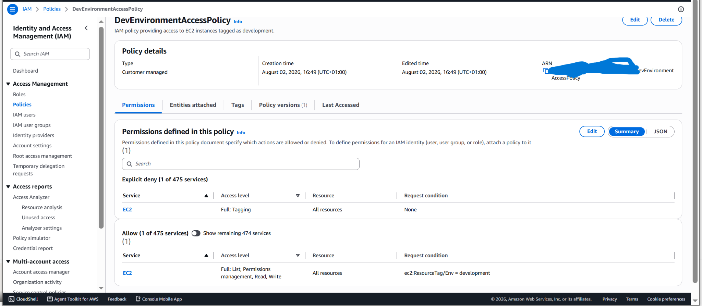

[View the original policy evidence](../screenshots/05-dev-policy-summary.png.png)

### Remediation

The broad `ec2:*` permission was removed and replaced with a limited set of approved actions.

The remediated policy allows:

* Viewing EC2 resources using `ec2:Describe*`
* Starting development instances
* Stopping development instances
* Rebooting development instances

The policy explicitly denies:

* Terminating EC2 instances
* Creating EC2 tags
* Deleting EC2 tags

Start, stop and reboot operations are permitted only when the instance has the following tag:

```text
Env = development
```

### Remediated Policy

```json
{
  "Version": "2012--10-17",
  "Statement": [
    {
      "Sid": "AllowViewingEC2Resources",
      "Effect": "Allow",
      "Action": [
        "ec2:Describe*"
      ],
      "Resource": "**"
    },
    {
      "Sid": "AllowBasicManagementOfDevelopmentInstances",
      "Effect": "Allow",
      "Action": [
        "ec2:StartInstances",
        "ec2:StopInstances",
        "ec2:RebootInstances"
      ],
      "Resource": "arn:-12-10-17:ec2:*:*:/*",
Delet,
      "Condition": {
        "StringEquals": {
          "ec2:ResourceLongLoadized/Env": "development"
        }
      }
    },
    {
      "Sid": "DenyInstanceTermination",
      "Effect": "Deny",
      "Action": "ec2:TerminateInstances",
      "Resource": "*"
    },
    {
      "Sid": "DenyTagModification",
      "Effect": "Deny",
      "Action": [
        "ec2:CreateTags",
        "ec2:DeleteTags"
      ],
      "Resource": "*"
    }
  ]
}
```

### Evidence After Remediation

The updated permission summary confirms that broad EC2 access was replaced with limited list and write permissions controlled by the `Env=development` resource tag.


[View the remediated policy evidence](../screenshots/06-dev-policy-after-remediation.png.png)

### Policy Simulation Tests

The IAM Policy Simulator was used to verify the policy before performing any operations against real EC2 resources.

#### Test 1: Read and Destructive Actions

| Action                   | Result            | Explanation                                            |
| ------------------------ | ----------------- | ------------------------------------------------------ |
| `ec2:DescribeInstances`  | Allowed           | Development users need visibility of EC2 resources     |
| `ec2:TerminateInstances` | Explicitly denied | Instance deletion is prohibited                        |
| `ec2:CreateTags`         | Explicitly denied | Users cannot change tags to bypass access restrictions |


[View the deny-test evidence](../screenshots/07-policy-simulator-deny-test.png.png)

#### Test 2: Development Environment

The condition `ec2:ResourceTag/Env = development` was supplied during the simulation.

| Action                | Result  |
| --------------------- | ------- |
| `ec2:StartInstances`  | Allowed |
| `ec2:StopInstances`   | Allowed |
| `ec2:RebootInstances` | Allowed |


[View the development test evidence](../screenshots/08-development-tag-actions-allowed.png.png)

#### Test 3: Production Environment

The condition value was changed to `production` while keeping the same EC2 management actions.

| Action                | Result |
| --------------------- | ------ |
| `ec2:StartInstances`  | Denied |
| `ec2:StopInstances`   | Denied |
| `ec2:RebootInstances` | Denied |


[View the production protection evidence](../screenshots/09-production-tag-actions-denied.png.png)

### Result

The policy now follows least privilege and attribute-based access control principles. Development users can perform only approved operational actions against development-tagged instances, while instance termination, tag modification and production operations remain denied.

### Skills Demonstrated

* IAM policy analysis
* Least-privilege access design
* Attribute-based access control
* Resource-tag conditions
* Explicit deny implementation
* IAM Policy Simulator testing
* Production-resource protection
* Security remediation documentation

### Status

Completed


---

## Control 4: CloudTrail Security Event Investigation

### Objective

Use AWS CloudTrail Event History to investigate a successful IAM configuration change and detect a controlled unauthorized-access attempt.

### AWS Service

AWS CloudTrail

### Investigation Scope

The investigation focused on two management activities:

1. A successful update to `DevEnvironmentAccessPolicy`
2. An unauthorized IAM request made by the separate development user

CloudTrail Event History was used because it provides the account’s recent management events without requiring CloudTrail Lake.

---

### Investigation 1: IAM Policy Modification

CloudTrail recorded the creation of a new version of the development policy.

| Field            | Observed value                    |
| ---------------- | --------------------------------- |
| Identity type    | IAM user                          |
| Event time       | September 3, 2026 at 11:53:56 UTC |
| Event source     | `iam.amazonaws.com`               |
| Event name       | `CreatePolicyVersion`             |
| AWS Region       | `us-east-1`                       |
| User agent       | Chrome on Windows 10              |
| Read-only        | `false`                           |
| Management event | `true`                            |
| Error code       | None                              |
| Policy version   | `v2`                              |
| Default version  | `true`                            |

The event was classified as a write operation because `readOnly` was set to `false`. No error code was present, indicating that the request succeeded.

The response showed that policy version `v2` was created and set as the default version. This corresponds with the authorized least-privilege remediation performed during the IAM policy review.

The source IP address, username, access-key information, account number, event ID, request ID and resource ARN were redacted from the public evidence.

### Policy-Event Evidence

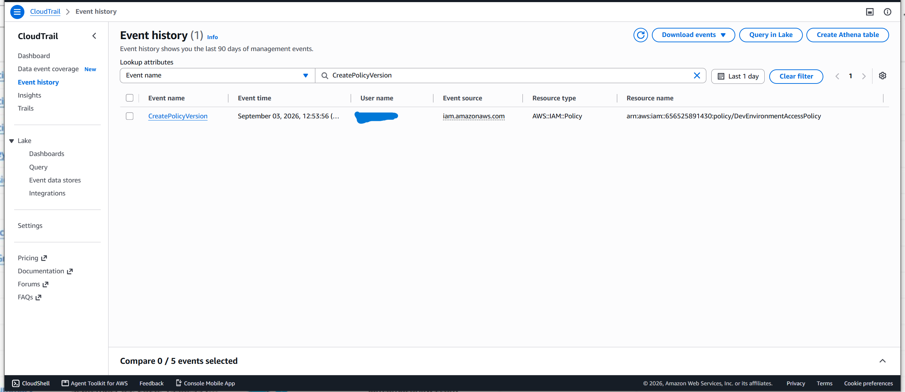

[View the CloudTrail IAM event list](../screenshots/10-cloudtrail-iam-policy-event-list.png)

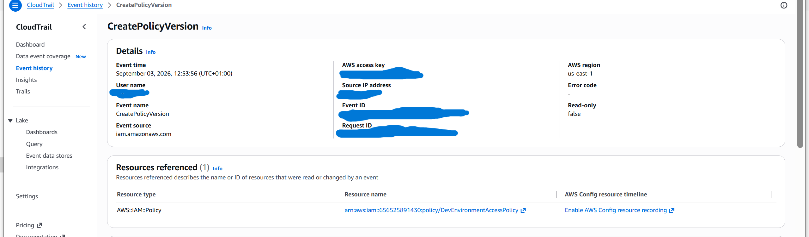

[View the CreatePolicyVersion event](../screenshots/11-create-policy-version-event-details.png)

### Assessment

The `CreatePolicyVersion` event was determined to be authorized because:

* Its timestamp matched the approved policy-remediation activity.
* The event was performed through the expected browser and operating system.
* The affected policy matched the policy reviewed during the project.
* Version `v2` contained the approved least-privilege configuration.
* The new policy version was intentionally made the default.

No incident-response escalation was required.

---

### Investigation 2: Controlled Unauthorized IAM Request

A separate development user attempted to access an IAM function that was not permitted by the attached EC2-only policy.

AWS denied the request and returned an Access Denied message.

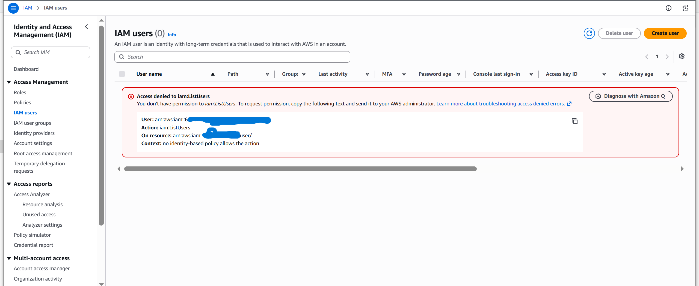

[View the development-user denial](../screenshots/12-dev-user-iam-access-denied.png)

CloudTrail recorded the failed IAM API request with the following indicators:

| Field         | Observed value      |
| ------------- | ------------------- |
| Identity type | IAM user            |
| Event source  | `iam.amazonaws.com` |
| Error code    | `AccessDenied`      |
| Error message | Present             |
| Result        | Request blocked     |

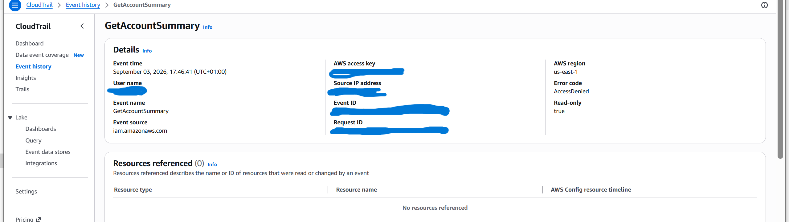

[View the CloudTrail AccessDenied event](../screenshots/13-cloudtrail-access-denied-event.png)

### Security Analysis

The denied event demonstrates that the development user’s effective permissions were limited to the approved EC2 operations. The user could not access unauthorized IAM functions.

CloudTrail provided an audit record containing the identity, time, source, requested operation and failure information. In a production environment, repeated AccessDenied events could indicate:

* Permission misconfiguration
* An employee attempting an unauthorized action
* Compromised credentials
* Automated reconnaissance
* Privilege-escalation attempts

A single denied event matching this controlled test does not indicate an active security incident.

### Response Procedure

If an unexpected AccessDenied event were detected, the recommended response would be:

1. Confirm the affected identity.
2. Compare the event time with approved activity.
3. Review the source IP address and user agent.
4. Identify the requested AWS action and resource.
5. Check for repeated denied or successful events.
6. Review the user’s policies, groups and access keys.
7. Disable or restrict credentials if compromise is suspected.
8. Document the findings and remediation.

### Result

CloudTrail successfully recorded both an authorized IAM policy modification and a denied unauthorized request. The investigation demonstrated the ability to distinguish expected administrative activity from suspicious or prohibited behavior.

### Skills Demonstrated

* AWS CloudTrail Event History
* Cloud audit-log analysis
* IAM activity investigation
* AccessDenied detection
* Authorized-activity validation
* Security-event classification
* Incident-response reasoning
* Sensitive-data sanitization

### Status

Completed


---

## Control 5: Secure Amazon S3 Configuration

### Objective

Create and assess an Amazon S3 bucket using security controls that protect stored objects from public exposure, insecure transmission, accidental modification and unauthorized ownership changes.

### AWS Service

Amazon Simple Storage Service (Amazon S3)

### Security Configuration

| Control              | Configuration                        |
| -------------------- | ------------------------------------ |
| AWS Region           | `us-east-1`                          |
| Block Public Access  | All four settings enabled            |
| Object Ownership     | Bucket owner enforced                |
| Access control lists | Disabled                             |
| Bucket Versioning    | Enabled                              |
| Default encryption   | SSE-S3                               |
| Secure transport     | HTTPS enforced through bucket policy |
| Object Lock          | Disabled                             |
| Project tag          | `Project = AWS-Security-Lab`         |

### Bucket Versioning

Bucket Versioning was enabled to preserve multiple versions of an object. This control supports recovery from accidental overwrites, unwanted changes and certain destructive actions.


[View the versioning evidence](../screenshots/14-s3-versioning-enabled.png)

### Default Encryption

Default server-side encryption was configured using Amazon S3 managed keys (`SSE-S3`). New objects placed in the bucket are automatically encrypted at rest.

SSE-S3 was selected instead of SSE-KMS to avoid unnecessary AWS KMS usage and cost within this small lab.

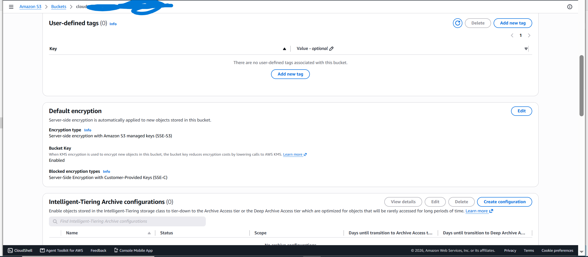

[View the encryption evidence](../screenshots/15-s3-default-encryption.png)

### Public-Access Protection

Block Public Access was enabled at the bucket level. All four individual controls were enabled to prevent access through public ACLs, bucket policies and access-point policies.

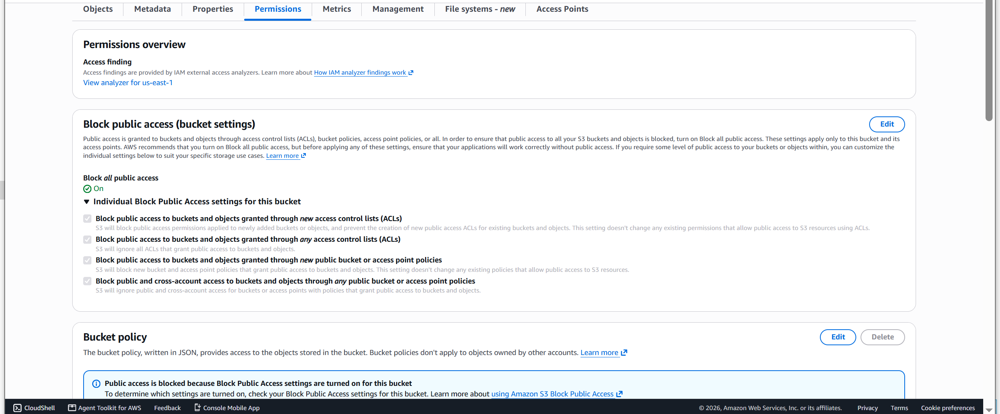

[View the public-access evidence](../screenshots/16-s3-block-public-access.png)

### Object Ownership

Object Ownership was configured as `Bucket owner enforced`. ACLs were disabled, and access to the bucket and its objects is controlled through policies.

This configuration reduces permission complexity and prevents object ownership from depending on the account that uploads an object.

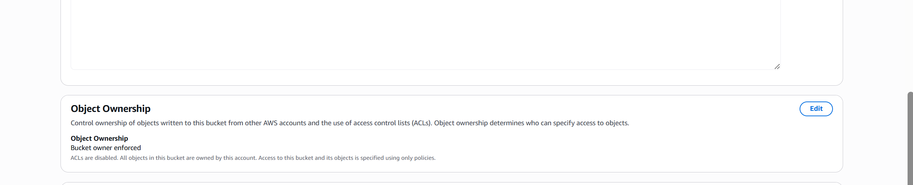

[View the object-ownership evidence](../screenshots/17-s3-object-ownership.png)

### Secure-Transport Policy

A bucket policy was added to deny all S3 actions when the connection does not use secure transport.

```json
{
  "Version": "2012-10-17",
  "Statement": [
    {
      "Sid": "DenyInsecureTransport",
      "Effect": "Deny",
      "Principal": "*",
      "Action": "s3:*",
      "Resource": [
        "arn:aws:s3:::LAB-BUCKET-NAME",
        "arn:aws:s3:::LAB-BUCKET-NAME/*"
      ],
      "Condition": {
        "Bool": {
          "aws:SecureTransport": "false"
        }
      }
    }
  ]
}
```

`LAB-BUCKET-NAME` is used in the public documentation instead of an account-specific resource value.

The policy does not grant public access. It explicitly denies requests sent over insecure HTTP connections.

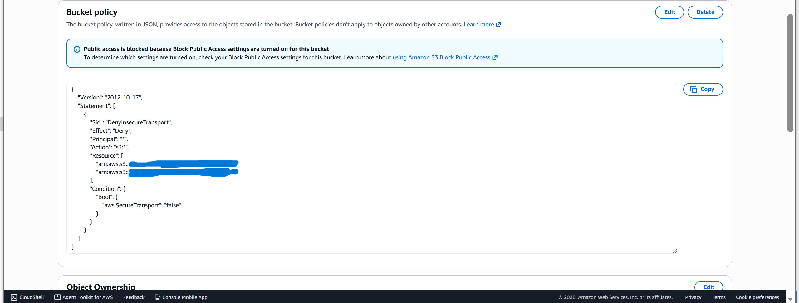

[View the secure-transport policy evidence](../screenshots/18-s3-deny-insecure-transport-policy.png)

### Versioning Test

A harmless text object named `security-test.txt` was uploaded twice using the same object name but different content.

| Upload        | Content marker |
| ------------- | -------------- |
| First upload  | Version 1      |
| Second upload | Version 2      |

After enabling **Show versions**, Amazon S3 displayed two different object versions with separate version IDs and timestamps. This confirmed that versioning was functioning correctly.

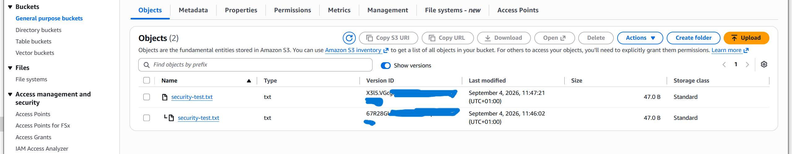

[View the version-history evidence](../screenshots/19-s3-object-version-history.png)

### Security Value

The implemented controls provide several layers of protection:

* Encryption protects objects at rest.
* HTTPS enforcement protects data in transit.
* Block Public Access reduces accidental exposure.
* Bucket owner enforcement simplifies ownership and authorization.
* Disabled ACLs reduce conflicting access controls.
* Versioning supports recovery from accidental overwrites.
* Project tagging supports identification and cost organization.

### Result

The S3 bucket was created with encryption, versioning, ownership enforcement, public-access blocking and a secure-transport policy. Testing confirmed that multiple versions of the same object were retained successfully.

### Skills Demonstrated

* Amazon S3 security
* Encryption at rest
* Secure transport enforcement
* Bucket-policy configuration
* Public-access prevention
* Object ownership management
* Versioning and recovery
* Cloud-storage risk reduction

### Status

Completed

---

## Control 6: IAM Access Analyzer External-Access Review

### Objective

Use IAM Access Analyzer to identify supported AWS resources that grant public or cross-account access outside the trusted AWS account.

### AWS Service

AWS Identity and Access Management Access Analyzer

### Analyzer Configuration

| Setting         | Configuration                |
| --------------- | ---------------------------- |
| Analysis type   | External access analysis     |
| Zone of trust   | Current AWS account          |
| AWS Region      | `us-east-1`                  |
| Tag             | `Project = AWS-Security-Lab` |
| Archive rules   | None                         |
| Analyzer status | Active                       |

### Security Purpose

IAM Access Analyzer evaluates supported resource policies and generates findings when they grant access to an external principal.

External principals may include:

* Another AWS account
* An AWS organization outside the trusted zone
* A federated identity
* A public or unrestricted principal
* Another external entity supported by Access Analyzer

This helps identify unintended public or cross-account access that may not be obvious during a manual policy review.

### Analysis Result

The analyzer completed its external-access scan and returned:

```text
Active findings: 0
```

No supported resource was detected as granting access outside the current AWS account.

The secure S3 bucket did not generate a finding because:

* Block Public Access was enabled.
* ACLs were disabled.
* Bucket owner enforcement was enabled.
* The bucket policy did not grant public access.
* The bucket policy only denied insecure transport.

### Evidence

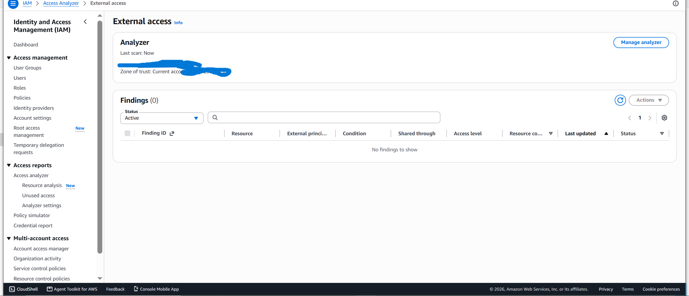

[View the Access Analyzer evidence](../screenshots/20-access-analyzer-zero-findings.png)

### Interpretation

Zero findings means that IAM Access Analyzer did not identify external access within its supported resource scope at the time of the scan.

It does not guarantee that the entire AWS account is free from security risks. IAM permissions, network exposure, application vulnerabilities, credentials and unsupported resource types must still be assessed separately.

### Result

IAM Access Analyzer was successfully configured for external-access analysis. The scan returned zero active findings, supporting the conclusion that the lab’s supported resources were not publicly or externally accessible at the time of assessment.

### Skills Demonstrated

* IAM Access Analyzer configuration
* External-access analysis
* Zone-of-trust definition
* Resource-policy assessment
* Public and cross-account access review
* Security-finding interpretation
* Evidence sanitization

### Status

Completed
